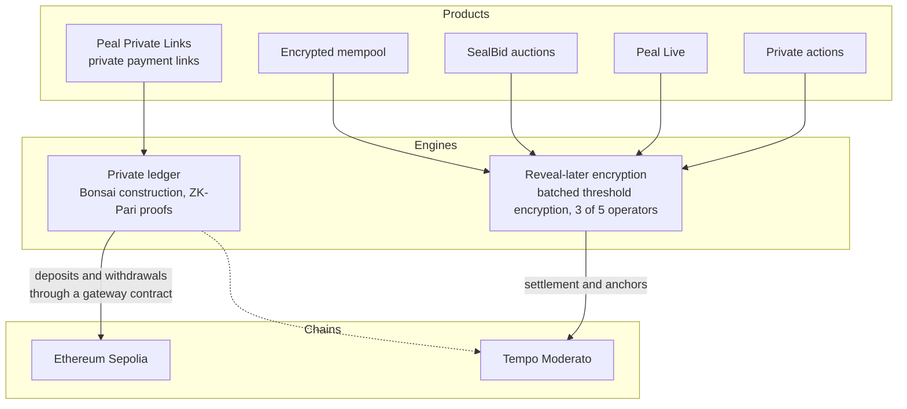
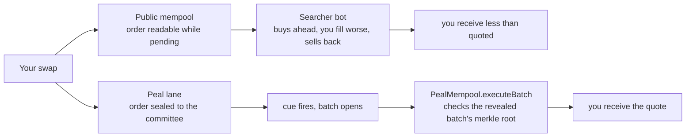
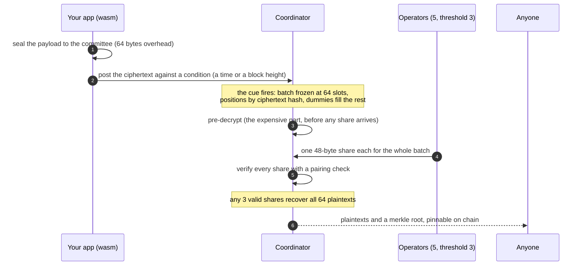
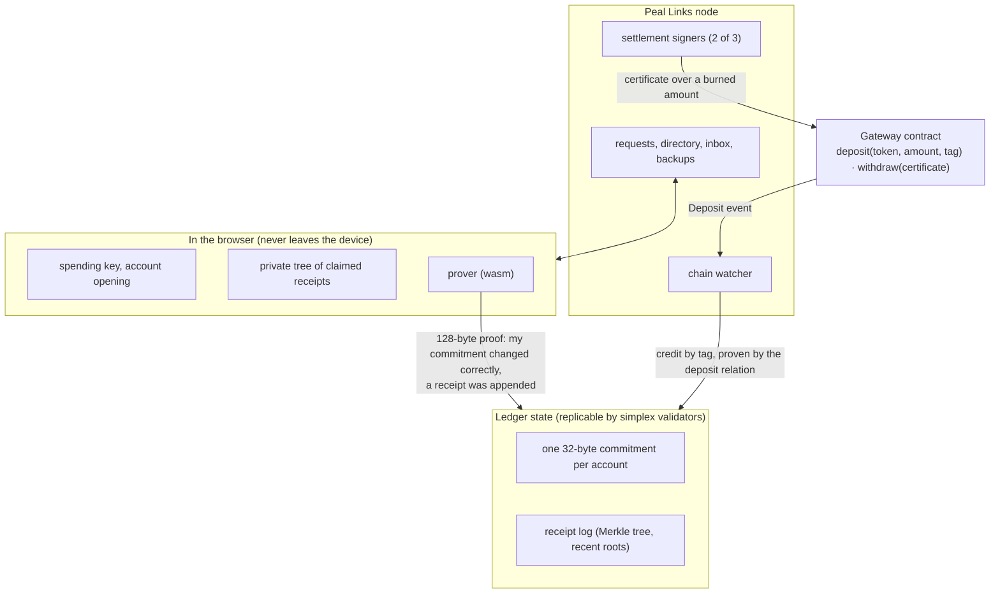
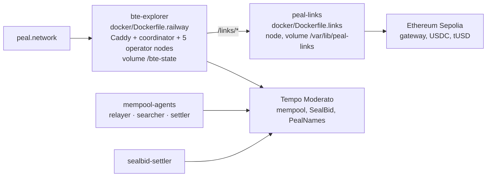

<h1 align="center">Peal</h1>
<h3 align="center">The programmable confidentiality layer for digital markets</h3>

<p align="center">
  <a href="https://peal.network">peal.network</a> ·
  <a href="https://peal.network/developers">developers</a> ·
  <a href="https://peal.network/developers/links">private links</a> ·
  <a href="https://peal.network/developers/links-api">API</a> ·
  <a href="https://peal.network/skill/SKILL.md">agent skill</a>
</p>

Peal is a network for two kinds of secrets. Information that must stay unreadable until a deadline, then open for everyone at once: bids, votes, orders, agent intents. And payments that stay private after they settle: a link anyone can pay from a wallet, with the amount and the parties on no chain. One site, two cryptographic engines, everything in this repository, and every claim below is something you can run.

**Reveal-later encryption.** Seal a payload to a committee and name a cue, a time or a block height. Nobody can read it early, not the operators, not the server, not the other participants. When the cue fires the whole batch opens at once, with a proof, and nobody had to come back to reveal. This runs sealed-bid auctions, an encrypted mempool where a real sandwich bot loses, and private agent actions.

**Private payments.** Peal Private Links: create a request, share the link, get paid into a private balance. Each payment is a zero-knowledge proof on a ledger that stores one commitment per account and nothing else. The ledger learns which account acted; it does not learn the amount, the other party, or whether it was a send or a receive. Only deposits and withdrawals touch the chain.

## Sixty seconds

- **Get paid privately.** Open [the app](https://peal.network/#/bonsai/app), connect a wallet on Sepolia, create a request, share the link. Test funds only; the app has a faucet for its test token.
- **Watch a sandwich bot lose.** [The encrypted mempool](https://peal.network/#/encrypted-mempool) sends the same swap into a public and a sealed lane on Tempo, live, and you sign nothing.
- **Run a sealed auction with no wallet.** [Peal Live](https://peal.network/#/create): name an item and a close time, get a link, anyone bids by typing a number.
- **Build on it.** Three calls seal, wait and read: the [quickstart](https://peal.network/developers/quickstart) runs them from the page. For private payments, the [SDK](https://peal.network/developers/links-sdk) and the [API](https://peal.network/developers/links-api). For a coding agent, `curl -fsSL https://peal.network/skill/install.sh | sh`.

## What is here

| product | what it does | where |
|---|---|---|
| Peal Private Links | private payment links and transfers, USDC on Ethereum Sepolia today | [peal.network/#/bonsai](https://peal.network/#/bonsai) · app at `#/bonsai/app` |
| Encrypted mempool | the same swap in a public and a sealed mempool, live on Tempo, a real sandwich bot loses | [peal.network/#/encrypted-mempool](https://peal.network/#/encrypted-mempool) |
| SealBid | escrowed, on-chain sealed-bid token auctions with one uniform clearing price | [peal.network/#/auction](https://peal.network/#/auction) |
| Peal Live | a sealed auction anyone can enter with no wallet, no sign-in, no gas | [peal.network/#/create](https://peal.network/#/create) |
| Private actions | agent intents that stay encrypted until their place in the batch is committed | [peal.network/#/execution](https://peal.network/#/execution) |
| The disclosure network | the API and SDK every product above is built on | [peal.network/developers](https://peal.network/developers) |



## What is real, and what is not yet

Real: the cryptography on both sides, every product on the site, the settlement contracts, the two live networks. Not yet: the trust model around them. The reveal committee's keys came from one dealer we ran, withdrawals from the private ledger are released by signers whose keys live in one process, and nothing has been audited. That is why everything runs on testnets and the node refuses a mainnet namespace beside its fixtures. [SECURITY.md](SECURITY.md) and [docs/peal-links/MAINNET_READINESS.md](docs/peal-links/MAINNET_READINESS.md) have the full list, and so does every page on the site: Peal never says trustless, unlinkable, or mainnet.

---

## Contents

- [Peal Private Links](#peal-private-links)
- [The encrypted mempool](#the-encrypted-mempool)
- [SealBid](#sealbid)
- [Peal Live](#peal-live)
- [Private actions](#private-actions)
- [How reveal-later encryption works](#how-reveal-later-encryption-works)
- [How the private ledger works](#how-the-private-ledger-works)
- [Run it locally](#run-it-locally)
- [Deployment](#deployment)
- [Repository map](#repository-map)
- [Tests](#tests)
- [Credits and license](#credits-and-license)

---

## Peal Private Links

One link, a private payment. You create a payment request (an amount in one asset, a title, an optional reference and expiry), share the link or its QR code, and receive the payment into a private balance. The payer needs nothing but a wallet. Between deposit and withdrawal, nothing about the payment is on any chain: not the amount, not the two parties, not whether it was a send or a receive.

It is built on **Bonsai**, Commonware's account-based private payment construction, with the **ZK-Pari** proof system. Every account on the ledger is one 32-byte commitment. A payment changes two commitments and appends one receipt, proven by a 128-byte proof made in the payer's browser in a few seconds.

### The flow


### One wallet, private by default

Your existing EVM wallet is the only identity anyone sees. On first use it signs one EIP-712 authorization for a private account and one recovery message; from then on it is the thing you connect, the thing people pay, and the thing that recovers you.

- **Receiving profile.** A signed record in the node's directory maps your `0x` address to your private account, so anyone can pay a plain address, and every client verifies the wallet's signature before paying.
- **Recovery.** Wallets that sign deterministically derive a backup key from a signature; the rest get a recovery code shown once. The node keeps an encrypted, versioned backup that only your wallet (or your code) can open.
- **Several wallets, one device.** Each wallet keeps its own account; several tabs of one browser share it safely through a lock and a versioned store.

### Who sees what

| who | sees | does not see |
|---|---|---|
| the public ledger | which account acted, and when | the amount, the other party, send or receive |
| the backing chain | deposits and withdrawals: address, amount, token | which private account a deposit went to, any payment in between |
| the payer | the amount, your display name and wallet address | your balance, your other payments |
| the receiver | the amount and, for a direct send, who paid | the payer's balance or history |
| Peal's directory | which wallet owns which private account | payments, amounts, balances |
| Peal's services | request titles and amounts you publish, encrypted receipts, timing, IP | receipt contents, spending keys, balances |

Full observer matrix and threats: [docs/peal-links/THREAT_MODEL.md](docs/peal-links/THREAT_MODEL.md).

### What is deployed

| network | assets | gateway | status |
|---|---|---|---|
| Ethereum Sepolia | USDC (Circle testnet), tUSD (faucet token) | `0xC141Bc6AaED24258276dC203050AD148ec95C1fC` | live behind peal.network |
| Tempo Moderato | PathUSD, tUSD | `0xE747A08e7cFea2574bCc9A0a8FCb6E02a68D6F39` | run on demand with `testnet.sh` |

Testnet funds only. Mainnet is blocked on purpose; see [docs/peal-links/MAINNET_READINESS.md](docs/peal-links/MAINNET_READINESS.md).

### For developers

Three pages on the site, prerendered so they read without JavaScript, and a reference file in the agent skill:

- [Peal Private Links](https://peal.network/developers/links): the pieces, how a payment moves, who sees what, what you are trusting.
- [Private Links SDK](https://peal.network/developers/links-sdk): the `peal-links` TypeScript client, every method, and running it from Node.
- [Private Links API](https://peal.network/developers/links-api): every route under `/links/v1`, with what authenticates it, the fields, the error codes and the limits. Two examples run against the live node from the page.
- `curl -fsSL https://peal.network/skill/install.sh | sh` installs the skill; `reference/links.md` is the private payments half.

### Where the code is

| part | path |
|---|---|
| Bonsai core: pinned circuits, wallet journal, ledger state transition, deposits, withdrawals | [`crates/peal-bonsai`](crates/peal-bonsai) |
| node: ledger API, requests, directory, encrypted inbox, backups, chain watcher, settlement signers | [`crates/peal-links-node`](crates/peal-links-node) |
| consensus: Commonware `simplex` over the ledger (three local validators) | [`crates/peal-links-consensus`](crates/peal-links-consensus) |
| browser wallet: proving, envelopes, backups, compiled to wasm | [`crates/peal-links-wasm`](crates/peal-links-wasm) |
| TypeScript SDK `peal-links` | [`packages/links`](packages/links) |
| gateway and test token | [`contracts/src/links`](contracts/src/links) |
| landing, dashboard, checkout | [`packages/explorer/src/pages`](packages/explorer/src/pages) (`bonsai-landing.ts`, `bonsai-app.ts`, `pay.ts`) |
| spec, decisions, build log, benchmarks, operations | [`docs/peal-links`](docs/peal-links) |

The SDK in four calls, from its own tests:

```ts
import { LinksAccount, newIntentId } from 'peal-links';

// receiver: one wallet signature authorizes a private account behind the wallet
const bob = await LinksAccount.setup(opts, circuitId, walletSigner, 'Bob', recovery);
const request = await bob.createRequest({ amount: '1250000000', title: 'Logo files' });

// payer: the wallet confirms a local intent, the browser proves the payment
const paid = await alice.pay({ request }, newIntentId(), { intent, signature });

// receiver, whenever next online: verify the encrypted receipt, claim it
await bob.syncInbox();
await bob.claimAll();
```

---

## The encrypted mempool

The same swap sent into two mempools at once, live on **Tempo Moderato (chain 42431)**, and you sign nothing.



- On the **public** side a real searcher bot with its own key reads your order and wraps a sandwich around it.
- On the **peal** side the chain sees only a ciphertext hash, so there is nothing to sandwich. At the cue the batch opens and your swap fills at the quoted price.

Nothing is a mock-up: both pools are real contracts, the searcher is real, and the sealed order settles through `PealMempool.executeBatch`, which re-derives the batch's merkle root and rejects anything else. A relayer sponsors both submissions so the visitor signs nothing.

| contract | role |
|---|---|
| `DemoToken` | mintable ERC-20 (mUSDC, mETH) |
| `SwapPool` | constant-product pool, 0.3% fee; both lanes reset to identical reserves before each swap |
| `PublicBuilder` | an unprotected mempool: orders deferred and broadcast in the clear, `sandwich()` wraps one atomically |
| `PealMempool` | `commitSealed` emits only a hash; `executeBatch` settles only the revealed batch |

Services in [`packages/mempool-agents`](packages/mempool-agents): the **relayer** (sponsored gateway, resets pools), the **searcher** (the bot), the **settler** (calls `executeBatch` after the reveal). Deployed addresses: [`packages/mempool-agents/deployments/42431.json`](packages/mempool-agents/deployments/42431.json). Deployment recipe: [docs/deploy-mempool-railway.md](docs/deploy-mempool-railway.md).

---

## SealBid

Escrowed, on-chain sealed-bid token auctions on Tempo Moderato. An issuer funds a supply and sets a price ladder; bidders escrow quantity times their maximum price; everyone who wins pays one uniform clearing price.

Each bid is sealed in the bidder's browser with batched threshold encryption and committed beside a salted commitment. There is no commit-reveal: the commitment only binds the decrypted bid to its bidder, the encryption is what hides it. At the close the batch opens, the settler ([`packages/sealbid-settler`](packages/sealbid-settler)) registers the committee-signed reveal root and processes every bid, and the contract checks each revealed bid against its commitment. Nobody keeps a salt and nobody sends a reveal transaction.

Contracts, client and trust assumptions: [`docs/auctionkit`](docs/auctionkit); the wiring decision is [0005](docs/auctionkit/decisions/0005-wire-bte.md); going live: [docs/deploy-sealbid-settler.md](docs/deploy-sealbid-settler.md). Client: [`packages/auctionkit`](packages/auctionkit).

---

## Peal Live

A seller names an item and a close time and gets a link. Anyone who opens it types a number and bids: no wallet, no sign-in, no gas. The bid is sealed in the bidder's browser, so the seller cannot read it before the close and neither can other bidders. At the close the whole batch opens and the page ranks it.

The terms ride in the URL fragment, so an auction is a link and needs no backend to exist. `peal.network/shoonya` works because [`PealNames`](contracts/src/PealNames.sol) on Tempo maps a name to those terms, once and permanently.

What it does not claim: nothing is escrowed (it settles who bid the most, not the payment), the close is the coordinator's clock, and the committee's keys came from one setup we ran. [`packages/live`](packages/live) is the pure half: no DOM, no network.

---

## Private actions

The intent shape for autonomous agents. An agent signs what it wants done and the worst terms it will accept; that intent stays encrypted until its position in the batch is committed; it settles with a receipt the agent can verify without trusting the operator. Positions are a pure function of the ciphertext set (sorted hashes), so there is no executor discretion to abuse.

Package: [`packages/actions`](packages/actions) (`peal-actions`: the envelope, EIP-712 signing, ordering commitment, receipt verification). Architecture and privacy model: [docs/private-actions-architecture.md](docs/private-actions-architecture.md), [docs/private-actions-privacy-model.md](docs/private-actions-privacy-model.md), gaps: [docs/private-actions-gaps.md](docs/private-actions-gaps.md).

Every network route is also mounted at `/v1/x402`, answering `402 Payment Required` with a price until shown an on-chain payment, so an agent with no account can still be a customer: [peal.network/developers/x402](https://peal.network/developers/x402).

---

## How reveal-later encryption works

Built on Commonware's [batched threshold encryption](https://commonware.xyz/blogs/bte) ([simple-bte](https://github.com/commonwarexyz/simple-bte), paper [eprint 2026/760](https://eprint.iacr.org/2026/760)), used unmodified as a dependency.




Before the cue nobody can read anything. After it, everybody can. That asymmetry is the product.

```ts
import { BteClient } from 'bte-sdk';

const client = new BteClient({ url: 'https://peal.network' });
const conditionId = await client.condition({ in: 60 });
await client.seal('sealed bid: 42', conditionId);

const reveal = await client.waitForReveal(conditionId);
for (const slot of reveal.slots.filter((s) => !s.isDummy)) console.log(slot.text);
```

Measured with criterion at B=64, n=5, t=3 on a laptop:

| operation | cost |
|---|---|
| seal one payload (client wasm) | 416 µs |
| operator's share, whole batch | 1.16 ms, 48 bytes |
| verify one share (public) | 12 ms |
| pre-decrypt (hidden before shares arrive) | 245 ms |
| finalize after t shares | 37 ms |

`BteAnchor.sol` records ciphertext commitments per condition and the reveal's merkle root; the SDK recomputes the root from revealed payloads and checks it against the chain (`verifyAnchor`).

---

## How the private ledger works



- **Send**: publishes a sealed receipt into the log and moves the sender's commitment down by the amount, proven by the operation relation.
- **Receive**: proves a receipt at some position under a recent root is yours and unclaimed, and moves your commitment up; the nullifier is the position itself and is never published.
- **Operation hiding**: every operation publishes the same record shape and appends one receipt (a receive appends an unspendable dummy). Observers see the acting account and nothing else.
- **Deposits** carry a commitment tag; the watcher credits them after the configured confirmations and the wallet claims with a proof. **Withdrawals** burn with a proof and are released by a certificate the signers issue; any wallet can submit it, the tokens go to the certificate's recipient.

The construction is the paper's; what Peal added (deposits, withdrawals, identities, delivery, backups, consensus, a product) is listed in [docs/peal-links/RESEARCH.md](docs/peal-links/RESEARCH.md), and every design choice has a decision record under [docs/peal-links/decisions](docs/peal-links/decisions).

---

## Run it locally

Prerequisites: Rust stable, Node 20+, pnpm 11, [just](https://github.com/casey/just), wasm-pack, Foundry (`~/.foundry/bin`). Docker is optional; the local stacks run without it.

```bash
git clone https://github.com/Adityaakr/peal-network
cd peal-network
just setup            # toolchain, submodules, cargo fetch, pnpm install
```

**The disclosure network** (coordinator, ceremony, five operators, a sealed-bid demo):

```bash
just demo             # seals 8 bids, opens them after the 60 s cue
just demo-byzantine   # operator 2 posts bad shares; they fail the pairing check
pnpm -C packages/explorer dev   # the explorer, every condition live
```

**Peal Private Links** on two local chains with three consensus validators:

```bash
PEAL_LINKS_VALIDATORS=3 scripts/peal-links/stack.sh up   # anvil A and B, gateways, validators, explorer on :5176
open http://localhost:5176/#/bonsai/app
scripts/peal-links/stack.sh consensus                     # the three validators agree
scripts/peal-links/demo.sh                                # request, deposit, pay, claim, withdraw, end to end
```

**Peal Private Links on a public testnet** (a deployer key with testnet gas in `.dev-state/peal-links/sepolia-deployer.key`, never in git):

```bash
NETWORK=sepolia scripts/peal-links/testnet.sh deploy   # gateway + faucet token on Sepolia
NETWORK=sepolia scripts/peal-links/testnet.sh allow 0x1c7d4b196cb0c7b01d743fbc6116a902379c7238   # Circle's testnet USDC
NETWORK=sepolia scripts/peal-links/testnet.sh up       # node on :8795, explorer on :5173
NETWORK=sepolia scripts/peal-links/testnet.sh fund 0xYourWallet   # test token plus gas
NETWORK=tempo   scripts/peal-links/testnet.sh up       # Tempo Moderato: node :8796, explorer :5175
```

---

## Deployment

The live site runs on Railway as a few services from this repository.



- The explorer service must name `docker/Dockerfile.railway` explicitly in its settings; it proxies `/links/*` to the node through `LINKS_UPSTREAM`.
- The node service builds `docker/Dockerfile.links` (config in [`railway.links.json`](railway.links.json)), keeps its stores and proving material on one volume, takes the settlement signer keys from `PEAL_LINKS_SIGNER_KEYS`, and listens on `[::]:$PORT` for Railway's private network. Profile: [`config/peal-links.railway-sepolia.json`](config/peal-links.railway-sepolia.json).
- Recipes: [docs/peal-links/OPERATIONS.md](docs/peal-links/OPERATIONS.md) (hosting the node), [docs/deploy-mempool-railway.md](docs/deploy-mempool-railway.md), [docs/deploy-sealbid-settler.md](docs/deploy-sealbid-settler.md), [docs/deploy-railway.md](docs/deploy-railway.md).

No secrets live in the repository: signer keys, deployer keys and local state stay under `.dev-state/` and `.secrets/`, both ignored by git and by Docker builds.

---

## Repository map

| path | what |
|---|---|
| `crates/bte-crypto` | the only crate touching group elements; wraps simple-bte |
| `crates/bte-coordinator` | registry, condition engine, aggregator, REST, prerendered pages, sqlite |
| `crates/bte-node` | operator binary: encrypted keystore, outbound only |
| `crates/bte-cli` | ceremony, committee init, end-to-end driver |
| `crates/bte-wasm` | wasm bindings for sealing and share verification |
| `crates/peal-bonsai` | Bonsai private-payment core over the pinned ZK-Pari circuits |
| `crates/peal-links-node` | the Peal Links node |
| `crates/peal-links-consensus` | Commonware simplex consensus over the ledger |
| `crates/peal-links-wasm` | the browser wallet: proving, envelopes, backups |
| `packages/sdk` | `bte-sdk`: TypeScript plus inlined wasm, no bundler config |
| `packages/links` | `peal-links`: the Peal Private Links SDK |
| `packages/explorer` | the site: landing pages, explorer, Peal Live, the mempool demo, Peal Private Links |
| `packages/live` | `peal-live`: the pure half of Peal Live |
| `packages/auctionkit` | client for SealBid |
| `packages/actions` | `peal-actions`: agent intents |
| `packages/mempool-agents` | relayer, searcher, settler for the mempool demo |
| `packages/sealbid-settler` | the committee's on-chain arm for SealBid |
| `contracts/` | `BteAnchor`, `PealNames`, the mempool contracts, `links/PealLinksGateway`, `auctionkit/` |
| `config/` | node profiles: local, Sepolia, Tempo, the hosted Sepolia profile |
| `scripts/peal-links/` | `stack.sh` (local), `testnet.sh` (Sepolia, Tempo), `demo.sh` |
| `docker/`, `railway/` | images and Railway service configs |
| `docs/` | product docs, decisions, build logs, deployment recipes |
| `solana/` | a native program that checks a Peal inclusion proof on chain; self-contained, not deployed |
| `extension/` | the browser extension |

---

## Tests

```bash
cargo test --workspace                                   # Rust: crypto, coordinator, Bonsai core, consensus (deterministic, four simulated validators)
cargo test -p peal-bonsai --release                      # pinned ZK-Pari send and receive on the persistent ledger
pnpm -r test                                             # TypeScript: SDKs, Peal Live, actions
cd contracts && forge test                               # Solidity: anchor, names, mempool, gateway, auctions
pnpm -C packages/explorer test:e2e                       # Playwright against the local stack: the one-wallet flow, edge cases, screenshots
```

Continuous integration runs `cargo fmt --check`, `cargo clippy -D warnings` and the workspace tests on every push.

---

## Credits and license

The cryptography is Commonware's: [simple-bte](https://github.com/commonwarexyz/simple-bte) by Guru Vamsi Policharla ([eprint 2026/760](https://eprint.iacr.org/2026/760)) for reveal-later encryption, and the Bonsai construction with ZK-Pari ([eprint 2026/1987](https://eprint.iacr.org/2026/1987), prototype pinned by revision) for private payments. Peal is not affiliated with or endorsed by Commonware. Peal adds the network around them: coordinator, operator nodes, the private ledger node and consensus, wire formats, SDKs, contracts, and the products.

Apache-2.0. See [NOTICE](NOTICE).
