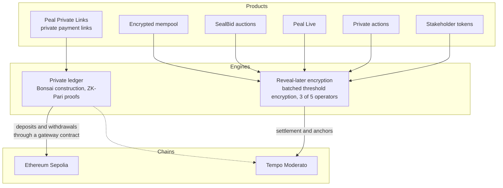
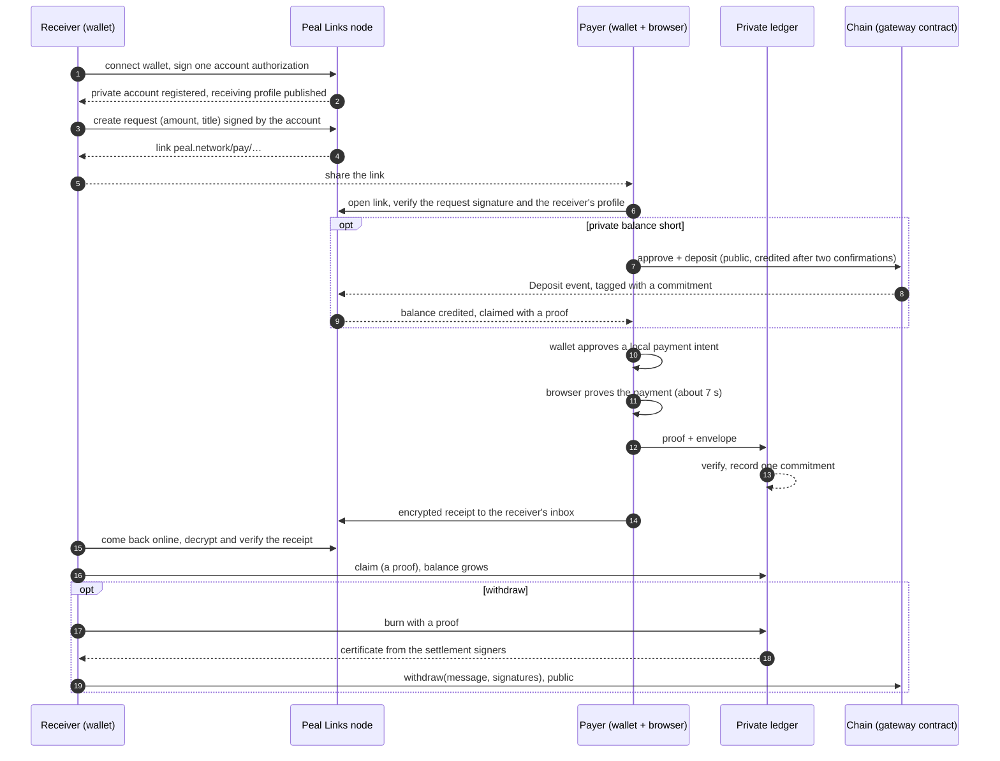
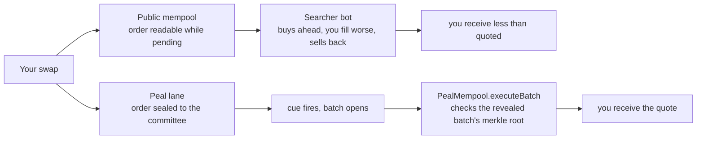
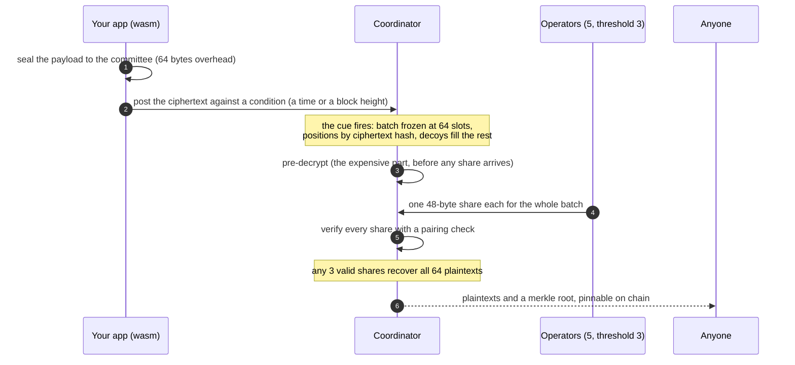
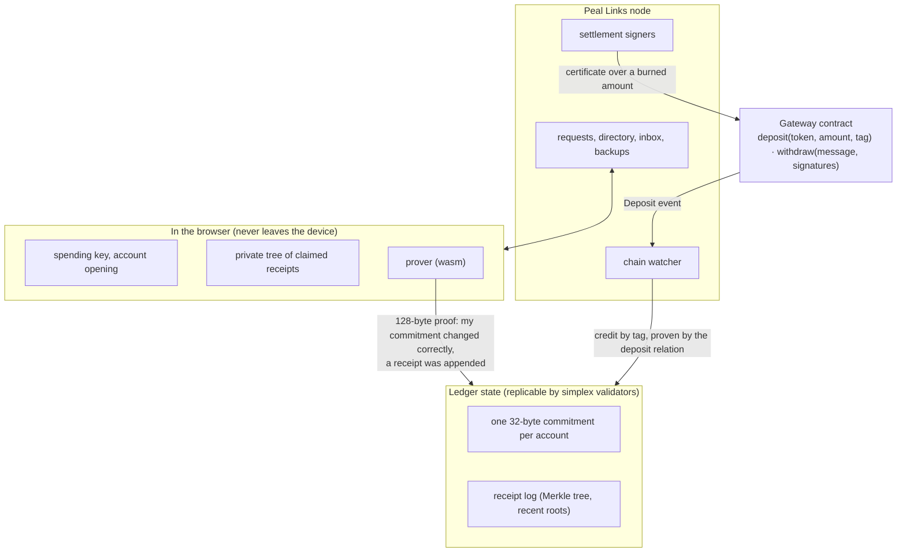
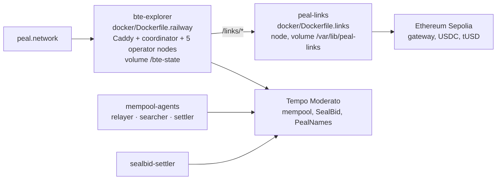

<h1 align="center">Peal</h1>
<h3 align="center">The programmable confidentiality layer for digital markets</h3>

<p align="center">
  <a href="https://peal.network">peal.network</a> ·
  <a href="https://peal.network/developers">developers</a> ·
  <a href="https://peal.network/developers/api">API playground</a> ·
  <a href="https://peal.network/developers/links">private links</a> ·
  <a href="https://peal.network/skill/SKILL.md">agent skill</a>
</p>

Peal is a live network for two kinds of secrets. Information that must stay unreadable until a deadline and then open for everyone at once: bids, votes, orders, agent intents. And payments that stay private after they settle: a link anyone can pay from a wallet, with the amount and the parties on no chain.

Two cryptographic engines run it. **Reveal-later encryption** seals a payload to a committee against a cue, a time or a block height, and opens the whole batch at the cue with a proof, without anyone coming back to reveal. **A private payment ledger** stores one commitment per account and accepts a payment only with a zero-knowledge proof made in the payer's browser. Every product below is built on one of the two, every one is running at [peal.network](https://peal.network), and everything is in this repository.

## Live today

| product | what it does | where |
|---|---|---|
| **Peal Private Links** | private payment links and transfers on a zero-knowledge ledger; USDC on Ethereum Sepolia | [peal.network/#/bonsai](https://peal.network/#/bonsai) · app at [`#/bonsai/app`](https://peal.network/#/bonsai/app) |
| **Encrypted mempool** | the same swap in a public and a sealed mempool on Tempo; a real sandwich bot runs against the public one and loses to the sealed one | [peal.network/#/encrypted-mempool](https://peal.network/#/encrypted-mempool) |
| **SealBid** | escrowed, on-chain sealed-bid token auctions with one uniform clearing price | [peal.network/#/auction](https://peal.network/#/auction) |
| **Peal Live** | a sealed auction anyone can run from a link; bidders need no wallet, no sign-in, no gas | [peal.network/#/create](https://peal.network/#/create) |
| **Private actions** | the intent format for autonomous agents: encrypted until its position in the batch is committed, settled with a verifiable receipt | [peal.network/#/execution](https://peal.network/#/execution) |
| **Stakeholder tokens** | sealed-demand fundraising: funded instructions open together and clear at one valuation | [peal.network/#/stakeholder-tokens](https://peal.network/#/stakeholder-tokens) |
| **Metered calls (x402)** | every API route mounted a second time behind HTTP 402, so an agent with no account pays per call | [peal.network/developers/x402](https://peal.network/developers/x402) |
| **The disclosure API and SDKs** | the network every product above is built on: three calls seal, wait and read | [peal.network/developers](https://peal.network/developers) |



## Sixty seconds

- **Get paid privately.** Open [the app](https://peal.network/#/bonsai/app), connect a wallet on Sepolia, create a request, share the link. The app has a faucet for its test token.
- **Watch a sandwich bot lose.** [The encrypted mempool](https://peal.network/#/encrypted-mempool) sends the same swap into a public and a sealed lane on Tempo, live, and you sign nothing.
- **Run a sealed auction with no wallet.** [Peal Live](https://peal.network/#/create): name an item and a close time, get a link, anyone bids by typing a number.
- **Call the API from the page.** Every endpoint on the [API playground](https://peal.network/developers/api) has a run button, including the private ledger's public reads.
- **Hand it to an agent.** `curl -fsSL https://peal.network/skill/install.sh | sh` installs a skill that integrates both engines without reading any of this.

---

## Contents

- [What to build](#what-to-build)
- [Peal Private Links](#peal-private-links)
- [The encrypted mempool](#the-encrypted-mempool)
- [SealBid](#sealbid)
- [Peal Live](#peal-live)
- [Private actions](#private-actions)
- [Stakeholder tokens](#stakeholder-tokens)
- [Metered calls with x402](#metered-calls-with-x402)
- [How reveal-later encryption works](#how-reveal-later-encryption-works)
- [How the private ledger works](#how-the-private-ledger-works)
- [The developer surface](#the-developer-surface)
- [Run it locally](#run-it-locally)
- [Deployment](#deployment)
- [Repository map](#repository-map)
- [Tests](#tests)
- [Credits and license](#credits-and-license)

---

## What to build

The reveal-later shape is always the same: people commit to something they cannot take back, and nobody sees anyone else's until they all open together. That is the missing piece in a lot of things.

| use case | what Peal supplies | the shape |
|---|---|---|
| **Sealed actions for autonomous agents, paid per call** | evidence that nobody could peek, copy, alter or open an action early; payment without an account | `POST /v1/seals` with a deadline, or the metered twin at `/v1/x402/seals` |
| **Sealed bid auctions** | nobody can watch the leader and top it by a dollar in the last second, because there is nothing to watch | one round per auction, one seal per bid, `tag: auction:<id>` |
| **Encrypted mempools** | orders seal to the block they belong in, so a searcher cannot read the queue and jump it; the block's worth opens at once | one condition per block height, `kind: at_block` |
| **Commit and reveal, without the reveal** | whoever is losing cannot decline to reveal, because the reveal is not their move to make | one round per game round |
| **Votes that cannot be swayed** | no running tally, so no bandwagon and no strategic vote cast off the back of one | one round per poll |
| **Quotes, tenders and RFQs** | every supplier prices blind and all prices open together | one round per tender |
| **Embargoed disclosure** | a forecast, a model output or an announcement fixed now and published at the hour, provably unchanged | a lone seal against a time |
| **Token launches and raises** | funded demand sealed until the close, one clearing price for everyone | SealBid for tokens, stakeholder tokens for raises |

The private-payment shape is different and just as simple: a link, a wallet, a payment nobody but the two parties can read.

| use case | what Peal supplies | the shape |
|---|---|---|
| **Invoices and payment links** | a request with an amount, a title and a reference; the payer pays from any wallet | `createRequest` then share `/pay/<id>` |
| **Payroll, grants and payouts** | a direct send to a wallet address that resolves to a private account | `resolve(address)` then `pay` |
| **A shop that receives privately** | one receiving account in your server, a request per order, receipts matched by reference | the recipe in the agent skill |
| **Agent-to-agent settlement** | an agent holds an account, proves its own payments, and reads receipts it can verify | the SDK from Node |

---

## Peal Private Links

One link, a private payment. You create a request (an amount in one asset, a title, an optional reference and expiry), share the link or its QR code, and receive the payment into a private balance. The payer needs a wallet and nothing else. Between deposit and withdrawal, nothing about the payment is on any chain: not the amount, not the two parties, not whether it was a send or a receive.

It is built on **Bonsai**, Commonware's account-based private payment construction, with the **ZK-Pari** proof system. Every account on the ledger is one 32-byte commitment. A payment changes two commitments and appends one receipt, proven by a 128-byte proof made in the payer's browser in a few seconds. The ledger verifies the proof and records which account acted. It learns nothing else.

### The flow



### One wallet is the whole identity

Your existing EVM wallet is the only identity anyone sees. On first use it signs one EIP-712 authorization for a private account; from then on it is the thing you connect, the thing people pay, and the thing that recovers you.

- **Receiving profile.** A signed, versioned record in the node's directory maps your `0x` address to your private account and receiving key, so anyone can pay a plain address. Every client verifies the wallet's signature and the version chain before paying.
- **Recovery.** Wallets that sign deterministically derive a backup key from one signature over a fixed message; the rest get a recovery code shown once. The node keeps an encrypted, versioned backup only that key opens.
- **Several wallets, one device.** Each wallet keeps its own account. Several tabs of one browser share an account through a lock and a versioned store, so a stale tab never submits against an old commitment.
- **Operation hiding.** Every operation publishes a record of the same shape and appends exactly one receipt; a receive appends an unspendable dummy. The public log shows the acting account and a sequence number, and that is all.

### Who sees what

| who | sees | does not see |
|---|---|---|
| the public ledger | which account acted, and when | the amount, the other party, send or receive |
| the backing chain | deposits and withdrawals: address, amount, token | which private account a deposit went to, any payment in between |
| the payer | the amount, the receiver's display name and wallet address | the receiver's balance or other payments |
| the receiver | the amount and, for a direct send, who paid | the payer's balance or history |
| the node | request titles and amounts you publish, encrypted receipts, encrypted backups, timing | receipt contents, spending keys, balances, payment approvals |

### Deployed

| network | assets | gateway |
|---|---|---|
| Ethereum Sepolia (11155111) | USDC (Circle), tUSD (faucet) | `0xC141Bc6AaED24258276dC203050AD148ec95C1fC` |
| Tempo Moderato (42431) | PathUSD, tUSD | `0xE747A08e7cFea2574bCc9A0a8FCb6E02a68D6F39` |

The hosted node serves Sepolia at `https://peal.network/links/v1`. One call configures a client: `GET /links/v1/status` lists the namespaces (chain, token, decimals, gateway, confirmations), the circuit id and the settlement signers.

### For developers

- [Peal Private Links](https://peal.network/developers/links): the pieces, how a payment moves, who sees what.
- [Private Links SDK](https://peal.network/developers/links-sdk): the `peal-links` TypeScript client, every method, running it from Node.
- [Private Links API](https://peal.network/developers/links-api): every route under `/links/v1` with what authenticates it, the fields, the error codes and the limits. The public reads also run from the [API playground](https://peal.network/developers/api).
- The agent skill's `reference/links.md`: the procedure, a shop recipe, a verification script.

```ts
import { LinksAccount, NodeClient, loadParams, newIntentId, paymentIntentTypedData, siweMessage } from 'peal-links';
import { createLocalProver } from 'peal-links/local';

// one node, one namespace (an asset on a chain), one prover
const client = new NodeClient({ baseUrl: 'https://peal.network' });
const status = await client.status();
const ns = status.namespaces.find((n) => n.label === 'sepolia/USDC')!;
const prover = await createLocalProver();               // in a page: createRemoteProver(worker)
await loadParams(client, prover, store);                 // proving keys, verified by digest

// a session for requests, the profile and backups
const { nonce } = await client.nonce();
const message = siweMessage({ domain: 'peal.network', address: signer.address, uri: 'https://peal.network', chainId: ns.chain_id, nonce });
await client.session(message, await signer.signMessage(message));

// receiver: one wallet signature authorizes a private account; a request needs no popup
const bob = await LinksAccount.setup({ prover, client, namespace: ns.id, store }, status.circuit_id, signer, 'Bob', recovery);
const request = await bob.createRequest({ amount: '12500000', title: 'Logo files' });   // 12.50 USDC, base units

// payer: the wallet approves a local intent, the browser proves the payment
const fetched = await client.getRequest(request.manifest.request_id);
const intent = await alice.paymentIntentFor({ request: fetched });
const signature = await signer.signTypedData(paymentIntentTypedData(intent, ns.chain_id));
await alice.pay({ request: fetched }, newIntentId(), { intent, signature });

// receiver, whenever next online
await bob.sync();
await bob.claimAll();
```

### Where the code is

| part | path |
|---|---|
| Bonsai core: pinned circuits, wallet journal, ledger state transition, deposits, withdrawals | [`crates/peal-bonsai`](crates/peal-bonsai) |
| node: ledger API, requests, directory, encrypted inbox, backups, chain watcher, settlement signers | [`crates/peal-links-node`](crates/peal-links-node) |
| consensus: Commonware `simplex` over the ledger | [`crates/peal-links-consensus`](crates/peal-links-consensus) |
| browser wallet: proving, envelopes, backups, compiled to wasm | [`crates/peal-links-wasm`](crates/peal-links-wasm) |
| TypeScript SDK `peal-links` | [`packages/links`](packages/links) |
| gateway and test token | [`contracts/src/links`](contracts/src/links) |
| landing, dashboard, checkout | [`packages/explorer/src/pages`](packages/explorer/src/pages) (`bonsai-landing.ts`, `bonsai-app.ts`, `pay.ts`) |
| spec, decisions, build log, benchmarks, operations | [`docs/peal-links`](docs/peal-links) |

---

## The encrypted mempool

The same swap sent into two mempools at once, live on **Tempo Moderato (chain 42431)**, and you sign nothing.



- On the **public** side a real searcher bot with its own key reads your order and wraps a sandwich around it.
- On the **Peal** side the chain sees only a ciphertext hash, so there is nothing to sandwich. At the cue the batch opens and your swap fills at the quoted price.

Both pools are real contracts, the searcher is real, and the sealed order settles through `PealMempool.executeBatch`, which re-derives the batch's merkle root on chain and rejects anything else. A relayer sponsors both submissions so the visitor signs nothing.

| contract | role |
|---|---|
| `DemoToken` | mintable ERC-20 (mUSDC, mETH) |
| `SwapPool` | constant-product pool, 0.3% fee; both lanes reset to identical reserves before each swap |
| `PublicBuilder` | an unprotected mempool: orders deferred and broadcast in the clear, `sandwich()` wraps one atomically |
| `PealMempool` | `commitSealed` emits only a hash; `executeBatch` settles only the revealed batch |

Services in [`packages/mempool-agents`](packages/mempool-agents): the **relayer** (sponsored gateway, resets pools), the **searcher** (the bot), the **settler** (calls `executeBatch` after the reveal). Deployed addresses: [`packages/mempool-agents/deployments/42431.json`](packages/mempool-agents/deployments/42431.json). Deployment recipe: [docs/deploy-mempool-railway.md](docs/deploy-mempool-railway.md).

---

## SealBid

Escrowed, on-chain sealed-bid token auctions on Tempo Moderato. An issuer funds a supply and sets a price ladder; bidders escrow quantity times their maximum price; everyone who wins pays one uniform clearing price.

Each bid is sealed in the bidder's browser with batched threshold encryption and committed beside a salted commitment. There is no commit-reveal: the commitment binds the decrypted bid to its bidder, the encryption is what hides it. At the close the batch opens, the settler ([`packages/sealbid-settler`](packages/sealbid-settler)) registers the committee-signed reveal root and processes every bid, and the contract checks each revealed bid against its commitment. Nobody keeps a salt and nobody sends a reveal transaction.

Contracts, client and design: [`docs/auctionkit`](docs/auctionkit); the wiring decision is [0005](docs/auctionkit/decisions/0005-wire-bte.md); going live: [docs/deploy-sealbid-settler.md](docs/deploy-sealbid-settler.md). Client: [`packages/auctionkit`](packages/auctionkit).

---

## Peal Live

A seller names an item and a close time and gets a link. Anyone who opens it types a number and bids: no wallet, no sign-in, no gas. The bid is sealed in the bidder's browser, so the seller cannot read it before the close and neither can other bidders. At the close the whole batch opens and the page ranks it.

The terms ride in the URL fragment, so an auction is a link and needs no backend to exist. `peal.network/shoonya` works because [`PealNames`](contracts/src/PealNames.sol) on Tempo maps a name to those terms, once and permanently. A check code, eight speakable characters over the terms, lets a seller read them out and a bidder compare them. [`packages/live`](packages/live) is the pure half: no DOM, no network.

---

## Private actions

The intent shape for autonomous agents. An agent signs what it wants done and the worst terms it will accept; the intent stays encrypted until its position in the batch is committed; it settles with a receipt the agent can verify without trusting the operator. Positions are a pure function of the ciphertext set (sorted hashes), so there is no executor discretion.

The [execution page](https://peal.network/#/execution) ships a receipt verifier that runs `verifyReceipt` from `peal-actions` in your own tab on a receipt built in that tab: a fresh agent key, a real EIP-712 signature over the envelope, a merkle root over a real batch and a real inclusion proof. Break it on purpose and watch a named check fail.

Package: [`packages/actions`](packages/actions) (`peal-actions`: the envelope, EIP-712 signing, ordering commitment, receipt verification). Architecture and privacy model: [docs/private-actions-architecture.md](docs/private-actions-architecture.md), [docs/private-actions-privacy-model.md](docs/private-actions-privacy-model.md).

---

## Stakeholder tokens

Sealed-demand fundraising. An issuer structures the raise and publishes the documents that define the rights; an eligible investor escrows USDC before entering the book, so every instruction is backed by funds; the amount and the maximum acceptable valuation are sealed before submission, so the issuer, the other investors and the operators see no readable book; at the deadline every funded instruction opens together and a rule fixed in advance returns one valuation, the allocations and the refunds. Tokens are then issued against the signed documents and proceeds follow the contractual waterfall. The product page: [peal.network/#/stakeholder-tokens](https://peal.network/#/stakeholder-tokens).

---

## Metered calls with x402

Every route under `/v1` is mounted a second time under `/v1/x402`. Same handlers, same request, same response. The metered twin answers `402 Payment Required` with the asset, the amount, the payee and the chain, until it is shown an on-chain payment; then it does the work and the response carries the transaction hash. An agent that cannot sign up for a service, accept terms or hold an API key can still pay for one request. The free API is unchanged.

The [x402 page](https://peal.network/developers/x402) runs the whole handshake from the page: it mints a key in your tab, has Tempo fund it, pays the price and makes the call, with the diagram wired to the real events. The [API playground](https://peal.network/developers/api) has a switch that sends every run through the metered twin.

---

## How reveal-later encryption works

Built on Commonware's [batched threshold encryption](https://commonware.xyz/blogs/bte) ([simple-bte](https://github.com/commonwarexyz/simple-bte), paper [eprint 2026/760](https://eprint.iacr.org/2026/760)), used unmodified as a dependency.




Before the cue nobody can read anything: operators below the threshold learn nothing, and the coordinator holds ciphertexts and no key that opens one. After it, everybody can. Shares are publicly verifiable, so a bad share is rejected rather than corrupting a reveal. Positions come from the ciphertext hashes and a merkle root covers the set, so a batch cannot be reordered or edited after the fact.

```ts
import { BteClient } from 'bte-sdk';

const client = new BteClient({ url: 'https://peal.network' });
const conditionId = await client.condition({ in: 60 });
await client.seal('sealed bid: 42', conditionId);

const reveal = await client.waitForReveal(conditionId);
for (const slot of reveal.slots.filter((s) => !s.isDummy)) console.log(slot.text);
```

Measured with criterion at B=64, n=5, t=3 on a laptop:

| operation | cost |
|---|---|
| seal one payload (client wasm) | 416 µs |
| operator's share, whole batch | 1.16 ms, 48 bytes |
| verify one share (public) | 12 ms |
| pre-decrypt (hidden before shares arrive) | 245 ms |
| finalize after t shares | 37 ms |

The reveal a user feels is the 37 ms, because the 245 ms was pipelined before the shares arrived. `BteAnchor.sol` records ciphertext commitments per condition and the reveal's merkle root; the SDK recomputes the root from revealed payloads and checks it against the chain (`verifyAnchor`). Sealed payloads are padded to fixed widths so a ciphertext's length says nothing about its value.

---

## How the private ledger works



The ledger stores, per account, one commitment `com = Com(balance, nullifier_root; r)`. Every operation is a proof of the operation relation `R_op` over a public statement `(account, com, com', receipt, root)` and a private witness `(send or receive, balance, amount, counterparty, randomness)`:

- **Send**: the new commitment is the old balance minus the amount; the published receipt commits to the amount and the receiver, sealed to the receiver's key and delivered through the node's inbox.
- **Receive**: the new commitment is the old balance plus the amount; the consumed receipt is proven to exist under a recent root and to be unclaimed, by an insertion into the account's private nullifier tree; the published receipt is an unspendable dummy.
- Both branches share one circuit with a hidden selector, so the record, its size and its cost are identical either way. Balances and amounts are range-checked to 64 bits.
- **Deposits** carry a commitment tag proven by a second relation, `R_dep`, so the chain never names the account; the watcher credits the tag after the namespace's confirmations and the wallet claims it with a proof. **Withdrawals** are a proven send to a fixed burn account, followed by a certificate from the settlement signers over the burned amount, which anyone can submit to the gateway; the recipient is inside the signed message.

The proof is verified by the node before any record is written, re-verified for the whole history on restart, and verified independently by each consensus validator. What Peal added to the construction (deposits, withdrawals, identities, delivery, backups, consensus, the product) is in [docs/peal-links/RESEARCH.md](docs/peal-links/RESEARCH.md); every design choice has a decision record under [docs/peal-links/decisions](docs/peal-links/decisions).

---

## The developer surface

| | |
|---|---|
| [Introduction](https://peal.network/developers) and [quickstart](https://peal.network/developers/quickstart) | three calls, run from the page |
| [How it works](https://peal.network/developers/howitworks) | the cue, where encryption happens, what you can verify afterwards |
| [API reference](https://peal.network/developers/api) | every endpoint with a playground: rounds, seals, auctions, reference, and the private ledger's public reads |
| [Metered calls (x402)](https://peal.network/developers/x402) | the 402 handshake, run live |
| [Peal Private Links](https://peal.network/developers/links) · [SDK](https://peal.network/developers/links-sdk) · [API](https://peal.network/developers/links-api) | the private payment engine, end to end |
| [Limits and errors](https://peal.network/developers/limits) | every code, every limit |
| [Use it from an agent](https://peal.network/developers/agents) | the installable skill: sealed submissions and private payments, with recipes, verification scripts and the mistakes that produce code which looks right and is wrong |
| [`/llms.txt`](https://peal.network/llms.txt) | the site for models |

Packages: `bte-sdk` (seal, wait, read, verify; wasm inlined, no bundler config), `peal-links` (the private payment client), `peal-actions` (agent intents), `peal-live` (the pure half of Peal Live), `auctionkit` (SealBid). The drop-in browser client is `https://peal.network/peal.js`.

---

## Run it locally

Prerequisites: Rust stable, Node 20+, pnpm 11, [just](https://github.com/casey/just), wasm-pack, Foundry (`~/.foundry/bin`). Docker is optional; the local stacks run without it.

```bash
git clone https://github.com/Adityaakr/peal-network
cd peal-network
just setup            # toolchain, submodules, cargo fetch, pnpm install
```

**The disclosure network** (coordinator, ceremony, five operators, a sealed-bid demo):

```bash
just demo             # seals 8 bids, opens them after the 60 s cue
just demo-byzantine   # operator 2 posts bad shares; they fail the pairing check
pnpm -C packages/explorer dev   # the explorer, every condition live
```

**Peal Private Links** on two local chains with three consensus validators:

```bash
PEAL_LINKS_VALIDATORS=3 scripts/peal-links/stack.sh up   # anvil A and B, gateways, validators, explorer on :5176
open http://localhost:5176/#/bonsai/app
scripts/peal-links/stack.sh consensus                     # the three validators agree
scripts/peal-links/demo.sh                                # request, deposit, pay, claim, withdraw, end to end
```

**Peal Private Links on a public testnet** (a deployer key with testnet gas in `.dev-state/peal-links/sepolia-deployer.key`, never in git):

```bash
NETWORK=sepolia scripts/peal-links/testnet.sh deploy   # gateway + faucet token on Sepolia
NETWORK=sepolia scripts/peal-links/testnet.sh allow 0x1c7d4b196cb0c7b01d743fbc6116a902379c7238   # Circle's testnet USDC
NETWORK=sepolia scripts/peal-links/testnet.sh up       # node on :8795, explorer on :5173
NETWORK=sepolia scripts/peal-links/testnet.sh fund 0xYourWallet   # test token plus gas
NETWORK=tempo   scripts/peal-links/testnet.sh up       # Tempo Moderato: node :8796, explorer :5175
```

---

## Deployment

The live site runs on Railway as a few services from this repository.



- The explorer service names `docker/Dockerfile.railway` in its settings; it proxies `/links/*` to the node through `LINKS_UPSTREAM`.
- The node service builds `docker/Dockerfile.links` (config in [`railway.links.json`](railway.links.json)), keeps its stores and proving material on one volume, takes the settlement signer keys from `PEAL_LINKS_SIGNER_KEYS`, and listens on `[::]:$PORT` for Railway's private network. Profile: [`config/peal-links.railway-sepolia.json`](config/peal-links.railway-sepolia.json).
- Recipes: [docs/peal-links/OPERATIONS.md](docs/peal-links/OPERATIONS.md) (hosting the node), [docs/deploy-mempool-railway.md](docs/deploy-mempool-railway.md), [docs/deploy-sealbid-settler.md](docs/deploy-sealbid-settler.md), [docs/deploy-railway.md](docs/deploy-railway.md).

No secrets live in the repository: signer keys, deployer keys and local state stay under `.dev-state/` and `.secrets/`, both ignored by git and by Docker builds.

---

## Repository map

| path | what |
|---|---|
| `crates/bte-crypto` | the only crate touching group elements; wraps simple-bte |
| `crates/bte-coordinator` | registry, condition engine, aggregator, REST, prerendered pages, sqlite |
| `crates/bte-node` | operator binary: encrypted keystore, outbound only |
| `crates/bte-cli` | ceremony, committee init, end-to-end driver |
| `crates/bte-wasm` | wasm bindings for sealing and share verification |
| `crates/peal-bonsai` | Bonsai private-payment core over the pinned ZK-Pari circuits |
| `crates/peal-links-node` | the Peal Links node |
| `crates/peal-links-consensus` | Commonware simplex consensus over the ledger |
| `crates/peal-links-wasm` | the browser wallet: proving, envelopes, backups |
| `packages/sdk` | `bte-sdk`: TypeScript plus inlined wasm, no bundler config |
| `packages/links` | `peal-links`: the Peal Private Links SDK |
| `packages/explorer` | the site: landing pages, explorer, Peal Live, the mempool demo, Peal Private Links, the developer pages |
| `packages/live` | `peal-live`: the pure half of Peal Live |
| `packages/auctionkit` | client for SealBid |
| `packages/actions` | `peal-actions`: agent intents |
| `packages/mempool-agents` | relayer, searcher, settler for the mempool demo |
| `packages/sealbid-settler` | the committee's on-chain arm for SealBid |
| `contracts/` | `BteAnchor`, `PealNames`, the mempool contracts, `links/PealLinksGateway`, `auctionkit/` |
| `config/` | node profiles: local, Sepolia, Tempo, the hosted Sepolia profile |
| `scripts/peal-links/` | `stack.sh` (local), `testnet.sh` (Sepolia, Tempo), `demo.sh` |
| `skills/` | the agent skill served at `/skill` |
| `docker/`, `railway/` | images and Railway service configs |
| `docs/` | product docs, decisions, build logs, deployment recipes |
| `extension/` | the browser extension |

---

## Tests

```bash
cargo test --workspace                                   # Rust: crypto, coordinator, Bonsai core, consensus (deterministic, four simulated validators)
cargo test -p peal-bonsai --release                      # pinned ZK-Pari send and receive on the persistent ledger
pnpm -r test                                             # TypeScript: SDKs, Peal Live, actions
cd contracts && forge test                               # Solidity: anchor, names, mempool, gateway, auctions
pnpm -C packages/explorer test:e2e                       # Playwright against the local stack: the one-wallet flow, edge cases, screenshots
```

Continuous integration runs `cargo fmt --check`, `cargo clippy -D warnings` and the workspace tests on every push.

---

## Credits and license

The cryptography is Commonware's: [simple-bte](https://github.com/commonwarexyz/simple-bte) by Guru Vamsi Policharla ([eprint 2026/760](https://eprint.iacr.org/2026/760)) for reveal-later encryption, and the Bonsai construction with ZK-Pari ([eprint 2026/1987](https://eprint.iacr.org/2026/1987), pinned by revision) for private payments. Peal is not affiliated with or endorsed by Commonware. Peal adds the network around them: coordinator, operator nodes, the private ledger node and consensus, wire formats, SDKs, contracts, and the products.

**License.** Apache-2.0, see [LICENSE](LICENSE) and [NOTICE](NOTICE). Use it, fork it, build on it, ship it commercially; keep the notices. The name Peal, the logo and peal.network identify the hosted network and are not part of the grant, so a fork should carry its own name.

## Contact

Built by [Adityaakr](https://github.com/Adityaakr).

- **Building on Peal, integrating it, or want a feature?** Open an [issue](https://github.com/Adityaakr/peal-network/issues) or a pull request.
- **Partnerships, commercial support, running a node or a committee for your product:** reach out through GitHub, and this section will carry a direct line shortly.
- **Found a security problem?** [SECURITY.md](SECURITY.md) has the disclosure process. Please do not open a public issue for it.
